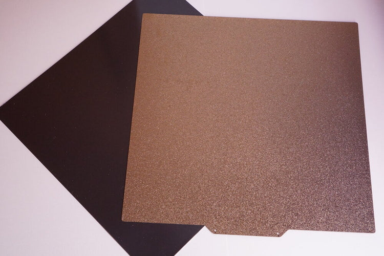

## Items in the box

| **Qty** | **Vendor Number**               | **Description**                                                                                             | **Notes**                        |
|---------|----------------------------------|-------------------------------------------------------------------------------------------------------------|----------------------------------|
| **Frame** |                                  |                                                                                                             |                                  |
| 1       | Printed Part Kit                 | Jubilee printed parts kit with press-fit dowel pins                                                         | [Printed Part Kit](https://github.com/machineagency/jubilee/tree/main/frame/fabrication_exports/3d_printed_parts/frame)|
| 1       | Build Plate + Magnetic Sticky Sheet | 305x305mm spring steel build plate and magnetic adhesive sticky sheet                                       |     |
| 1       | B7-408-0-1040-713                | Jubilee 8mm tool build plate                                                                                | |
| 2       | QL-LHR3-02-M6-MRW                | Aluminum Crossbar                                                                                           | |
| 1       | LDO-NMP-02-M6-MRW                | 1 set of XY Motor Plates                                                                                    | |
| 2       | Z-NMTBLS02                       | Jubilee Fastener Kit                                                                                        |    |
| 1       | TWLSwitchLock                    | Machined Twist Lock                                                                                         |      |
| 1       | LDO-Z-BT03-MotSet                | Z Axis Thrust Bearing                                                                                       |  |
| 1       | VDCGS3-Jub                       | Wire Cable and Spring Guide Set for Jubilee                                                                 |      |
| 1       | RELHub                           | REL Hub, 6mm Bore                                                                                           |         |
| 1       | SS625mr                          | REL Extension Spring                                                                                        | |
| 1       | SS16mm                           | M4 Shoulder Screw, 16mm long, 5mm diameter                                                                  |  |
| 1       | GenMotionSet                     | Genuine Gates Motion Set (3M timing belt, etc.)                                                             |      |
| 1       | UltrabaseM3Short                 | M3 Ultrabase 17 Tapered Heat Insert                                                                         |    |
| 1       | UltrabaseM4Short                 | M4 Ultrabase Tapered Long Heat Set Insert                                                                   |    |
| 1       | LDO-ZB7-ST8-T8x4                 | 8mm T8x4 Lead Screw, 375mm long                                                                             |      |
| 1       | LDO-POM-T8N-NUT                  | T8x4 POM Nut for Lead Screw                                                                                 |         |
| 1       | 5mm-MDSpacer                     | Spacer Set (M5 Spacers, 3mm tall, 10mm OD)                                                                  |      |
| 2       | PSRCM5x3x10                      | 2 x 24V ESA PSU                                                                                             |     |
| 1       | UltraframeKitCOLOR (Black, Blue, Purple) | Jubilee Extrusion Frame Kit                                                                                 | |
| 1       | MG13LinearRails                  | 450mm, MGX12 Linear Rails                                                                                   |    |
| 1       | 4040mm-Extrusion                 | 400mm extrusion rails for Jubilee                                                                           | |
| 1       | SC-40600-ND                      | Schaffner IEC320 C14 10A 120V Power Socket + 2x10A Fused Switch                                              |    |
| **Electronics** |                           |                                                                                                             |                                  |
| 1       | Duet 3 Mini Ethernet             | Duet 3 Mini Ethernet                                                                                        | |
| 1       | Duet3HC                          | Duet 3HC Expansion without CANBus Cable                                                                     |        |
| 1       | 120V Plug                        | Stepper Motor Pigtail, 120V Power Plug                                                                      |   |
| **Assembly Tools** |                        |                                                                                                             |                                  |
| 1       | 7130K12                          | 100-pack of 2.5mm (2 in.) thick zip ties                                                                    |        |
| 1       | HexInsertTips                    | M3-M4 heat set insert installation tip for soldering irons                                                  |     |
| 1       | BallEndHexKey                    | 1.5mm, 2.0mm, 2.5mm, 3.0mm ball end hex key                                                                 | |
| 1       | MachinistBlocks                  | Set of 25–50–75mm machinist blocks                                                                          | |
| 1       | Threadlocker Blue (2.5ml)        | 4 in. bar clamps                                                                                            |      |
| 1       | Threadlocker Blue (2.5ml)        | Threadlocker Blue (2.5ml)                                                                                   | |
| **Extras** |                               |                                                                                                             |                                  |
| 1       | SiliconeHeatedPad                | Silicone Heated Pad, 300x300x1mm, 750W, 120V with 1500 thermal cutoff                                        |      |
| 1       | SSR-240D25                       | Solid State Relay for Heated t’d                                                                            | |
| **Printing Plate Option** |                 |                                                                                                             |                                  |
| 1       | SSR-240D25                       | Solid State Relay for Heated t’d                                                                            | |
| **Side Panel Option** |                     |                                                                                                             |                                  |
| 1       | Jubilee Electronics Back Panel   | Jubilee CANbus Side Panel, PSU Side Panel                                                                   | |
