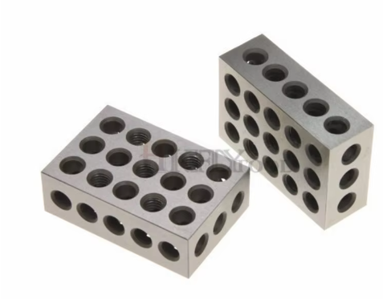

## Items in the box

| **Qty** | **Vendor Number**               | **Description**                                                                                             | **Notes**                        |
|---------|----------------------------------|-------------------------------------------------------------------------------------------------------------|----------------------------------|
| **Frame** |                                  |                                                                                                             |                                  |
| 1       | Printed Part Kit                 | Jubilee printed parts kit with press-fit dowel pins                                                         | [Printed Part Kit](https://github.com/machineagency/jubilee/tree/main/frame/fabrication_exports/3d_printed_parts/frame)|
| 1       | Build Plate + Magnetic Sticky Sheet | 305x305mm spring steel build plate and magnetic adhesive sticky sheet                                       |     |
| 1       | 07-PBED-04-K100-713                | Plain cast tool build plate                                                                               | |
| 2       | 041-CRS-02-M61-MRW                | Aluminum Crossbar                                                                                           | |
| 1       | 021-LMP-02-M61-MRW   021-RMP-02-M61-MRW            | 1 set of XY Motor Plates                                                      |   |
| 1       | Frame                                                 | Jubilee Fastener Kit                                                          |  |
| 1       | JubTwistLock                                           | Machined Twist Lock                                                           |   |
| 3       | JubZThrust                                             | Z Axis Thrust Bearing                                                         |   |
| 1       | WCSGS-JUB                                              | Wire Cable and Spring Guide Set for Jubilee                                   |   |
| 1       | LDOMotSetJub                                           | Jubilee XY ZZZ U Motor Motion Set                                             |   |
| 1       | RELHub                                                 | REL Hub, 6mm Bore                                                             |   |
| 1       | RELSpring                                              | REL Extension Spring                                                         |   |
| 6       | SS25mm                                                 | M4 Shoulder Screw, 25mm long, 5mm diameter                                    |   |
| 4       | SS16mm                                                 | M4 Shoulder Screw, 16mm long, 5mm diameter                                    |  |
| 1       | JubileeMotionSet                                       | Genuine Gates Motion Set for Jubilee                                          |   |
| 1       | UltrasertM3Short                                       | M3 "Ultrasert II" Tapered Heat Set Insert                                     |  |
| 1       | UltrasertM4Long                                        | M4 "Ultrasert II" Tapered Long Heat Set Insert                                |  |
| 3       | LDO-STD-375-T8x4                                       | 8mm T8x4 Lead Screw, 375mm long                                               |  |
| 3       | LDO-POM-T8x4-NUT                                       | T8x4 POM Nut for leadscrew.                                                   |  |
| 3       | 5x8Coupler                                             | 5mm-to-8mm Plum Coupler                                                       |  |
| 1       | SPCRM5x3x10                                            | 5-pack of M5 Spacers, 3mm tall, 10mm OD                                       |  |
| 1       | LRS-350-24                                             | 24V, 15A PSU                                                                  |  |
| 1       | JubFrameKit<COLOR> (Black, Blue, Purple)               | Jubilee Extrusion Frame Kit                                                   |  |
| 2       |                                                       | 450mm, MGN12H Linear Rails                                                    |  |
| 4       |                                                       | 400mm, MGN12C Linear Rails                                                    |  |
| 1       | Schaffner IEC320 C14 120V Power Socket + 2x 10A fuses  |  |                                                                              |
| 7       | 36-4000-ND                                             | Solder Terminal Lug (used as bed Spring Anchors)                              |  |
| 3       | 36-7328-ND                                             | Solder Terminal Lug (used as REL Spring Anchors)                              |  |
| 1       |                                                       | Jubilee Electronics Back Panel                                                |  |
| **Electronics** |  | **Dark Background** |
| 1       | n/a                                                    | Duet 3 Mini Ethernet                                                          |  |
| 1       | n/a                                                    | Duet 3HC Expansion without canbus cable                                       |  |
| 1       | n/a                                                    | Jubilee Wire Harness Kit                                                      |  |
| 2       | n/a                                                    | Stepper Motor Pigtail                                                         |  |
| 1       | n/a                                                    | 120V Power Plug                                                               |  |
| **Assembly Tools** | | **Dark Background** |
| 1       | 7130K12                                                | 100-pack of 2.5mm (0.1in.) thick zip ties                                     |  |
| 1       |                                                       | M3-M4 heat set Insert Installation Tip for soldering irons                    |  |
| 1       |                                                       | 1.5mm hex key (*not* ball end)                                                |  |
| 1       |                                                       | 2.0mm ball end hex key                                                        |  |
| 1       |                                                       | 2.5mm ball end hex key                                                        |  |
| 1       |                                                       | 3.0mm ball end hex key                                                        |  |
| 1       |                                                       | M3 hex nut driver                                                             |  |
| 1       |                                                       | Set of 2 25-50-75mm machinist blocks                                          |  |
| 2       |                                                       | 4-in. bar clamps                                                              |  |
| 1       |                                                       | Threadlocker Blue (2.5mL)                                                     |  |
| **Extras** |  | **Dark Background** |
| 1       | Jubilee Fastener Reference Sheet(s)                    | include this pdf printed at 100% scale.                                       | [Jubilee Fastener Reference Sheet](https://docs.google.com/viewer?url=https://github.com/machineagency/jubilee/raw/main/frame/assembly_instructions/vitamin_reference_sheet.pdf) |
| **Printing Plate Option** | | **Dark Background** |
| 1       |                                                       | Silicone Heated Pad, 300x300mm, 750W, 120V   with 150C thermal cutoff     |  |
| 1       | SSR-240D25                                             | Solid State Relay for Heated Bed                                              |  |
| **Side Panel Option** | | **Dark Background** |
| 1       |                                                       | Jubilee "Com Side" Side Panel                                                 |  |
| 1       |                                                       | Jubilee "PSU Side" Side Panel                                                 |  |
